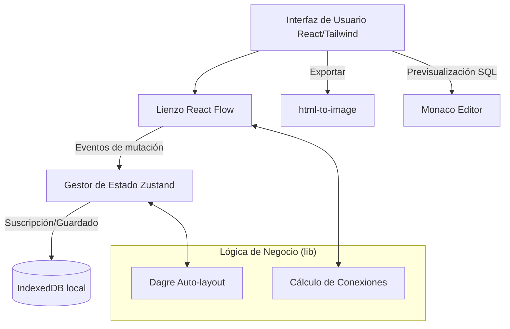
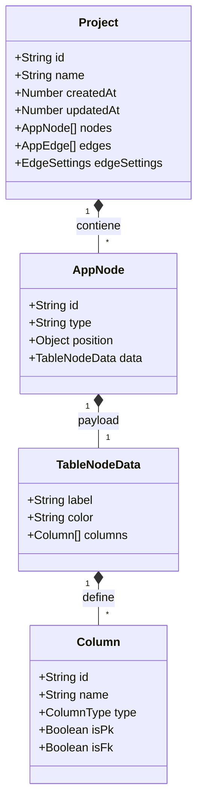

# Caso de Estudio: Arquitectura y Diseño de DB Designer

<!-- Placeholder para Logo -->

<!-- Placeholder para Captura de Pantalla -->

En este documento detallo mi análisis arquitectónico, los patrones de diseño y las decisiones técnicas que implementé en DB Designer, una herramienta del lado del cliente orientada a la creación, visualización y gestión de Diagramas de Entidad-Relación (ERD).

## Utilidad y Funcionamiento General

El propósito principal con el que construí DB Designer es resolver la necesidad de modelar esquemas de bases de datos de forma rápida, visual y sin dependencia de infraestructura en la nube. A menudo, observo que las herramientas de diseño de bases de datos requieren configuraciones complejas, cuentas de usuario o conexiones a bases de datos reales. Decidí mitigar esta barrera diseñando el sistema para operar de manera completamente offline y persistir la información de forma local mediante IndexedDB.

El flujo de trabajo principal que estructuré es directo:
1. **Inicialización**: El usuario accede al panel principal (Dashboard), donde puede visualizar proyectos anteriores o inicializar uno nuevo (ya sea desde cero o utilizando plantillas predefinidas).
2. **Modelado Visual**: En el editor que programé, el usuario agrega nodos que representan tablas. Implementé en cada tabla la adición dinámica de campos, permitiendo especificar su nombre, tipo de dato, y si actúa como Llave Primaria (PK) o Llave Foránea (FK).
3. **Relaciones Interactivas**: Al conectar nodos, mi sistema genera automáticamente representaciones visuales de relaciones (ej. 1:N) infiriendo la semántica a partir de la conexión gráfica. Desarrollé un sistema de enrutamiento inteligente (Smart Edges) para optimizar visualmente la ubicación de los puntos de conexión.
4. **Visualización y Exportación**: El usuario puede obtener una vista previa del código SQL generado basado en el modelo visual y exportar el diagrama completo en formato de imagen, funcionalidad que añadí para garantizar que el diseño pueda integrarse fácilmente en documentación externa.

## Análisis Profundo de Arquitectura y Modelos

Concebí este proyecto bajo una arquitectura orientada al cliente (Client-Side Architecture) enfocada en la autonomía del navegador, aprovechando las capacidades del App Router de Next.js pero desplazando el peso computacional y de almacenamiento enteramente al lado del cliente.

### Arquitectura General

El diseño de la aplicación que elaboré refleja patrones clave para mantener un código desacoplado, mantenible y eficiente:

- **Local-First Architecture**: Delegué la persistencia de datos completamente en el navegador del usuario utilizando `IndexedDB` a través de la librería `idb`. Integré esto para asegurar privacidad por diseño, baja latencia y disponibilidad offline (potenciada mediante PWA). Evité intencionalmente acoplar un backend para gestionar el estado central.
- **Gestión de Estado Predecible**: Utilizo `Zustand` para el estado global (como nodos, aristas, historial para deshacer/rehacer) con el fin de prevenir el *prop drilling* y facilitar las actualizaciones reactivas que requiere el lienzo interactivo (React Flow).
- **Separación de Preocupaciones**: Aislé los componentes visuales (UI) en componentes reutilizables (Botones, Selectores, Popovers). Extraje la lógica matemática para diagramas (posicionamiento auto-layout mediante `dagre` y cálculo de aristas inteligentes) en módulos puros ubicados en `/app/lib/`.

### Modelado de Datos y Lógica

Centralicé las definiciones del modelo de dominio en tipos estrictos de TypeScript (`/app/types.ts`), lo que me permite garantizar consistencia a lo largo del flujo de datos. Organicé las entidades principales alrededor de la estructura de un diagrama ER:

- **Project**: Entidad raíz que contiene metadatos del diagrama (ID, nombre, fechas de creación y actualización) así como la colección de nodos y aristas.
- **TableNodeData**: La carga útil principal de cada nodo de React Flow. Contiene la etiqueta de la tabla, su color semántico y un arreglo de columnas.
- **Column**: Define los atributos de una tabla, incluyendo su tipo de dato SQL, identificadores, y banderas booleanas para restricciones primarias o foráneas.

Manejo el estado de los nodos de forma inmutable. Los eventos interactivos en la interfaz (como añadir un campo pulsando "Enter") despachan acciones granulares que programé para actualizar únicamente el segmento relevante de mi almacén en Zustand.

### Stack Tecnológico

Las decisiones tecnológicas que tomé reflejan mi enfoque en la interactividad avanzada y la experiencia del desarrollador:

| Herramienta | Rol Técnico en la Arquitectura |
| :--- | :--- |
| **Next.js 16.1 (App Router)** | Lo elegí como framework base para el enrutamiento de páginas, estructura del proyecto y configuración PWA. |
| **React 19** | Biblioteca de UI principal; gestiono con ella la reactividad, los componentes portales y los eventos del DOM. |
| **Zustand** | Lo uso para la gestión del estado global asíncrono y síncrono. Soporta el sistema robusto de Undo/Redo del editor que implementé. |
| **React Flow (@xyflow/react)** | Lo integré como motor central de renderizado para el editor visual de grafos. Me permite gestionar el lienzo interactivo, nodos y conexiones. |
| **IndexedDB (idb)** | Me proporciona almacenamiento local asíncrono en el navegador. Soporta mi decisión de persistencia First-Local del modelo `Project`. |
| **Tailwind CSS v4** | Es mi sistema de diseño basado en utilidades; lo utilizo para manejar variables CSS semánticas aplicadas al modo claro/oscuro. |
| **Monaco Editor** | Componente de editor de código que integré para ofrecer una previsualización robusta de la sintaxis SQL. |
| **Dagre** | Lo utilizo como motor de posicionamiento automático (Auto-Layout) de gráficos dirigidos, ordenando visualmente los esquemas complejos de los diagramas. |

## Impacto de las Decisiones de Diseño

La arquitectura que diseñé maximiza la velocidad de respuesta en un entorno con un número alto de mutaciones rápidas en la interfaz (arrastrar nodos, editar texto interactivo). Al aplicar la persistencia asíncrona local y un gestor de estado ligero, logré evitar por completo los cuellos de botella de red. Mi uso exhaustivo de tipos estrictos en TypeScript y la separación de capas (aislando la presentación frente al cómputo de geometría visual) aseguran que el proyecto mantenga una alta estabilidad. Esta estructura garantiza que pueda extender el sistema en el futuro, añadiendo nuevas características analíticas o generativas en esquemas de bases de datos sin necesidad de realizar refactorizaciones destructivas.
